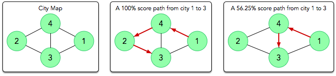

# Hard - NP (Advanced)

Jenna is playing a computer game involving a large map with $n$ cities numbered sequentially from $1$ to $n$ that are
connected by $m$ bidirectional roads. The game's objective is to travel to as many cities as possible without visiting
any city more than
once. The more cities the player visits, the more points they earn.

As Jenna's fellow student at Hackerland University, she asks you for help choosing an optimal path. Given the map, can
you help her find a path that maximizes her score?

Note: She can start and end her path at any two distinct cities.

## Input Format

The first line contains two space-separated integers describing the respective values of $n$  (the number of cities)
and $m$  (
the number of roads).
Each line $i$ of the $m$ subsequent lines contains two space-separated integers, $x_i$ and $y_i$, describing a
bidirectional road between
cities $x_i$ and $y_i$.

## Map Generation Algorithm

The graph representing the map was generated randomly in the following way:

1. Initially, the graph was empty.
2. Permutations $p_1,...,p_n$ were chosen uniformly at random among all $n!$ permutations.
3. For each $i \in \{1,...,n-1\}$, edge $(p_i,p_{i+1})$ was added to the graph.
4. An additional $m-n+1$ edges were chosen uniformly at random among all possible sets of $m-n+1$ edges which don't
   intersect with edges
   added during step 3.

## Constraints

- $1 \leq n \leq 10^4$
- $1 \leq m \leq 10^5$
- $1 \leq x_i,y_i \leq n$
- For 30% of test $n \leq 25$ and $m \leq 75$.
- For 50% of test $n \leq 100$ and $m \leq 500$.
- For 70% of test $n \leq 500$ and $m \leq 2500$.
- It's guaranteed that a valid path of length $n$ always exists.

## Scoring

A valid path of length $d$ earns $(\frac{d}{n})^2 \cdot 100\%$ of a test case's available points. The total score will
be rounded to next 5%.

## Output Format

Print the following two lines of output:

1. The first line must contain a single integer, $d$, denoting the length of the path.
2. The second line must contain $d$ distinct space-separated integers describing Jenna's path in the same order in which
   she
   visited each city.

### Sample Input

4 5
3 1
3 4
2 4
2 3
4 1

### Sample Output

4
1 4 2 3

### Explanation

The diagrams below depict the city's initial map, an optimal path that would earn a full score, and an alternative path
that would earn a partial score:

In the optimal path (center image), Jenna walks the path $1 \rightarrow 4\rightarrow 2\rightarrow 3$. This answer earns
100% of the maximum score because the path
length, $4$, is equal to $n$ (i.e., she was able to visit every city exactly once).

In the alternative path (right image), Jenna walks the path $1\rightarrow 4\rightarrow 3$
for $(\frac{3}{4})^2 \cdot 100\% = \frac{9}{16} \cdot 100\% = 56.25\% \implies 60\%$ of the maximum score.

### URL

https://www.hackerrank.com/challenges/walking-the-approximate-longest-path